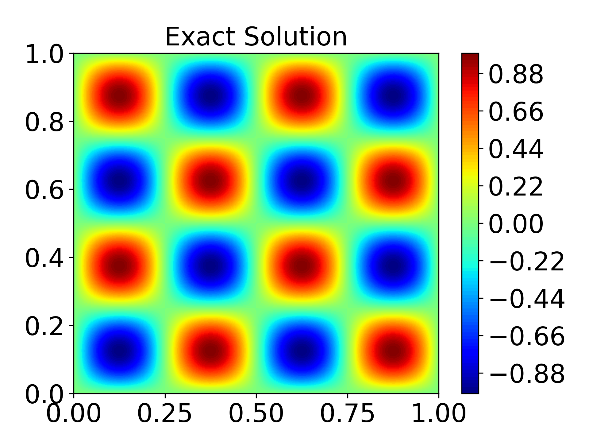

Solving forward problems with FastVPINNs : Poisson - 2D
=======================================================

In this example, we will learn how to solve a 2-dimensional Poisson problem using FastVPINNs. 
All the necessary files can be found in the examples folder of the `fastvpinns GitHub repository <https://github.com/cmgcds/fastvpinns>`_

.. math::

   -\varepsilon\Delta u(x) = f(x), \quad \ x \in \Omega = (0, 1)^2

where

.. math::

   f(x,y) = -2\omega^2 \sin{\omega x} \sin{\omega y}

For an :math:`\varepsilon = 1`, and considering :math:`\omega = 2 \pi` the
exact solution is given by

.. math::

   u(x,y) = -\sin{2 \pi x}\sin{2 \pi y}

We begin by introducing the various files required to run this example

Contents
--------

-  `Steps to run the code <#steps-to-run-the-code>`__

-  `Example File <#example-file>`__

   -  `Defining the boundary values <#defining-the-boundary-values>`__
   -  `Defining the forcing function <#defining-the-forcing-function>`__
   -  `Defining the bilinear parameters <#defining-the-bilinear-parameters>`__

-  `Input File <#input-file>`__

   -  `Experimentation parameters <#experimentation-parameters>`__
   -  `Geometry parameters <#geometry-parameters>`__
   -  `Finite element space parameters <#finite-element-space-parameters>`__
   -  `PDE Beta parameters <#pde-beta-parameters>`__
   -  `Model parameters <#model-parameters>`__
   -  `Logging parameters <#logging-parameters>`__

-  `Main File <#main-file>`__

   -  `Import relevant FastVPINNs methods <#import-relevant-fastvpinns-methods>`__
   -  `Reading the Input File <#reading-the-input-file>`__
   -  `Setting up the Geometry2D object <#setting-up-the-geometry2d-object>`__
   -  `Reading the boundary conditions and values <#reading-the-boundary-conditions-and-values>`__
   -  `Setting up the finite element space <#setting-up-the-finite-element-space>`__
   -  `Instantiating the model <#instantiating-the-model>`__
   -  `Training the model <#training-the-model>`__

-  `Solution <#solution>`__
-  `References <#references>`__

Steps to run the code
---------------------

To run the code, execute the following command:

.. code:: bash

   python3 main_poisson2d_hard.py input.yaml

`Back to Contents <#contents>`__

Example file
------------

The example file, ``sin_cos.py``, defines the boundary values,
the forcing function and exact function (if test error needs
to be calculated), bilinear parameters and the actual value of 
the parameter that needs to be estimated (if the error between 
the actual and estimated parameter needs to be calculated).

`Back to Contents <#contents>`__

Defining the boundary values
~~~~~~~~~~~~~~~~~~~~~~~~~~~~
Boundary values are defined using the functions ``get_boundary_function_dict`` and ``get_bound_cond_dict``.

.. figure:: rect.png
   :alt: Unit Square
   :align: center

For internally generated geometries, the boundary IDs will be hard-coded to 
1000  for bottom, 1001 for right, 1002 for top, and 1003 for left; as shown in the figure.

`Back to Contents <#contents>`__

Defining the forcing function
~~~~~~~~~~~~~~~~~~~~~~~~~~~~~

``rhs`` can be used to define the forcing function :math:`f`.

.. code:: python

   def rhs(x, y):
       """
       This function will return the value of the rhs at a given point
       """

       omegaX = 4.0 * np.pi
       omegaY = 4.0 * np.pi
       f_temp = -2.0 * (omegaX**2) * (np.sin(omegaX * x) * np.sin(omegaY * y))

       return f_temp

`Back to Contents <#contents>`__

Defining the bilinear parameters
~~~~~~~~~~~~~~~~~~~~~~~~~~~~~~~~

The bilinear parameters like diffusion constant can be defined by
``get_bilinear_params_dict``

.. code:: python

   def get_bilinear_params_dict():
       """
       This function will return a dictionary of bilinear parameters
       """
       eps = 1.0

       return {"eps": eps}

Here, ``eps`` denotes the diffusion constant.

`Back to Contents <#contents>`__

Input file
----------

The input file ``input.yaml``, is used to define inputs to your solver.
These are the usual parameters that are changed often throughout your
experimentation, hence it is best practice to pass these parameters
externally. The input file is divided based on the modules which use the
parameter.

`Back to Contents <#contents>`__

Experimentation parameters
~~~~~~~~~~~~~~~~~~~~~~~~~~

Defines the output path where the results will be saved.

.. code:: yaml

   experimentation:
     output_path: "output/poisson2d/1"  # Path to the output directory where the results will be saved.

`Back to Contents <#contents>`__

Geometry parameters
~~~~~~~~~~~~~~~~~~~

This section defines the geometrical parameters for your domain. 

-  In this example, we set the ``mesh_generation_method`` as ``"internal"``. 
   This generates a regular quadrilateral domain with a uniform mesh. 
-  The parameters in ``internal_mesh_params`` define the x and y limits of
   the quadrilateral domain(\ ``xmin``, ``xmax``, ``ymin`` and ``ymax``),
   number of cells in the domain in the x and y direction (``n_cells_x``
   and ``n_cells_y``), number of total boundary points
   (``n_boundary_points``) and number of test points in x and y direction
   (``n_test_points_x`` and ``n_test_points_y``).
-  ``mesh_type`` is set to “quadrilateral” which means that the mesh is
   a quadrilateral mesh. Note: FastVPINNs currently provides support for quadrilateral elements only.
   So, ``mesh_type`` is set to quadrilateral.
-  ``boundary_sampling_method`` is set to “uniform” which means that the
   boundary points are sampled using the “uniform” method. (Use only
   uniform sampling as of now.)
-  ``external_mesh_params`` can be used to specify parameters for the
   external mesh, and can be ignored for this example.

.. code:: yaml

   geometry:
      mesh_generation_method: "internal"  # Method for generating the mesh. Can be "internal" or "external".
      generate_mesh_plot: True  # Flag indicating whether to generate a plot of the mesh.
   
      # internal mesh generated quadrilateral mesh, depending on the parameters specified below.

      internal_mesh_params:  # Parameters for internal mesh generation method.
         x_min: 0  # Minimum x-coordinate of the domain.
         x_max: 1  # Maximum x-coordinate of the domain.
         y_min: 0  # Minimum y-coordinate of the domain.
         y_max: 1  # Maximum y-coordinate of the domain.
         n_cells_x: 4  # Number of cells in the x-direction.
         n_cells_y: 4  # Number of cells in the y-direction.
         n_boundary_points: 400  # Number of boundary points.
         n_test_points_x: 100  # Number of test points in the x-direction.
         n_test_points_y: 100  # Number of test points in the y-direction.
   
      exact_solution:
         exact_solution_generation: "internal" # whether the exact solution needs to be read from external file.
         exact_solution_file_name: "fem_solutions/neumann_solutions/solution_problem_3.txt" # External solution file name.

      mesh_type: "quadrilateral"  # Type of mesh. Can be "quadrilateral" or other supported types.
   
      external_mesh_params:  # Parameters for external mesh generation method.
         mesh_file_name: "meshes/hemker.mesh"  # Path to the external mesh file (should be a .mesh file).
         boundary_refinement_level: 4  # Level of refinement for the boundary.
         boundary_sampling_method: "uniform"  # Method for sampling the boundary. Can be "uniform"

`Back to Contents <#contents>`__

Finite Element Space parameters
~~~~~~~~~~~~~~~~~~~~~~~~~~~~~~~

The parameters related to the finite element space are defined here.

-  ``fe_order`` sets the order of the finite element test functions.

-  ``fe_type`` set which type of polynomial will be used as the finite element test function.

- ``quad_order`` is the number of quadrature in each direction in each cell. Thus the total number of quadrature points in each cell will be (quad_order)\ :math:`^2`

-  ``quad_type`` specifies the quadrature rule to be used.

.. code:: yaml

   fe:
     fe_order: 6 # Order of the finite element basis functions.
     fe_type: "legendre"  # Type of finite element basis functions. Can be "jacobi" or other supported types.
     quad_order: 10  # Order of the quadrature rule.
     quad_type: "gauss-jacobi"  # Type of quadrature rule. Can be "gauss-jacobi" or other supported types.

`Back to Contents <#contents>`__

PDE beta parameters
~~~~~~~~~~~~~~~~~~~

``beta`` specifies the weight by which the boundary loss will be
multiplied before being added to the PDE loss.

.. code:: yaml

   pde:
     beta: 10  # Parameter for the PDE.

`Back to Contents <#contents>`__

Model parameters
~~~~~~~~~~~~~~~~

The parameters pertaining to the neural network are specified here.

-  ``model_architecture`` is used to specify the dimensions of the neural network. In this example, [2, 50, 50, 50, 1] corresponds to a neural network with 2 inputs (for a 2-dimensional problem), 1 output (for a scalar problem) and 3 hidden layers with 30 neurons each.
-  ``activation`` specifies the activation function to be used.
-  ``use_attention`` specifies if attention layers are to be used in the model. This feature is currently under development and hence should be set to ``false`` for now.
-  ``epochs`` is the number of iterations for which the network must be trained.
-  ``dtype`` specifies which datatype (``float32`` or ``float64``) will be used for the tensor calculations.
-  ``set_memory_growth``, when set to ``True`` will enable tensorflow’s memory growth function, restricting the memory usage on the GPU. This is currently under development and must be set to ``False`` for now.
-  ``learning_rate`` sets the learning rate ``initial_learning_rate`` if a constant learning rate is used.
-  A learning rate scheduler can be used by toggling ``use_lr_scheduler`` to True and setting the corresponding decay parameters below it. The ``decay_steps`` parameter is the number of steps between each learning rate decay. The ``decay_rate`` parameter is the decay rate for the learning rate. The ``staircase`` parameter is a flag indicating whether to use the staircase decay.

.. code:: yaml

   model:
      model_architecture: [2, 50,50,50,50, 1]  # Architecture of the neural network model.
      activation: "tanh"  # Activation function used in the neural network.
      use_attention: False  # Flag indicating whether to use attention mechanism in the model.
      epochs: 10000  # Number of training epochs.
      dtype: "float32"  # Data type used for computations.
      set_memory_growth: False  # Flag indicating whether to set memory growth for GPU.

      learning_rate:  # Parameters for learning rate scheduling.
         initial_learning_rate: 0.001  # Initial learning rate.
         use_lr_scheduler: False  # Flag indicating whether to use learning rate scheduler.
         decay_steps: 1000  # Number of steps between each learning rate decay.
         decay_rate: 0.99  # Decay rate for the learning rate.
         staircase: False  # Flag indicating whether to use staircase decay.

`Back to Contents <#contents>`__

Logging parameters
~~~~~~~~~~~~~~~~~~

It specifies the frequency with which the progress bar and console
output will be updated, and at what interval will inference be carried
out to print the solution image in the output folder.

.. code:: yaml

   logging:
     update_console_output: 5000  # Number of steps between each update of the console output.

`Back to Contents <#contents>`__

Main file
---------

The main file ``main_poisson_2d.py`` which needs to be run for the experiment, with the
input file as an argument.

Following are the key components of a FastVPINNs main file

`Back to Contents <#contents>`__

Import relevant FastVPINNs methods
~~~~~~~~~~~~~~~~~~~~~~~~~~~~~~~~~~

.. code:: python

   from fastvpinns.data.datahandler2d import DataHandler2D
   from fastvpinns.FE.fespace2d import Fespace2D
   from fastvpinns.Geometry.geometry_2d import Geometry_2D

Will import the functions related to setting up the finite element
space, the 2D Geometry and the datahandler required to manage data and make
it available to the model.

.. code:: python

   from fastvpinns.model.modelimport DenseModel

Will import the model file where the neural network and its training
function is defined. The model file ``model.py`` contains the
``DenseModel`` class. The ``train_step`` function of this model is used
to train the model.

.. code:: python

   from fastvpinns.physics.poisson2d import pde_loss_poisson

Will import the loss function for the 2-dimensional Poisson problem.

.. code:: python

   from fastvpinns.utils.compute_utils import compute_errors_combined
   from fastvpinns.utils.plot_utils import plot_contour, plot_loss_function, plot_test_loss_function
   from fastvpinns.utils.print_utils import print_table

Will import functions to calculate the loss, plot the results and print
outputs to the console.

`Back to Contents <#contents>`__

Reading the Input File
~~~~~~~~~~~~~~~~~~~~~~

The input file is loaded into ``config``, and the input parameters are
read and assigned to their respective variables.

`Back to Contents <#contents>`__

Setting up the Geometry2D object
~~~~~~~~~~~~~~~~~~~~~~~~~~~~~~~~

.. code:: python

   domain = Geometry_2D(i_mesh_type, i_mesh_generation_method, i_n_test_points_x, i_n_test_points_y, i_output_path)

This will instantiate a ``Geometry_2D`` object ``domain``, with the mesh
type, mesh generation method and test points. In our example, the mesh
generation method is ``internal``, so the cells and boundary points will
be obtained using the ``generate_quad_mesh_internal`` method.

.. code:: python

   cells, boundary_points = domain.generate_quad_mesh_internal(
     x_limits=[i_x_min, i_x_max],
     y_limits=[i_y_min, i_y_max],
     n_cells_x=i_n_cells_x,
     n_cells_y=i_n_cells_y,
     num_boundary_points=i_n_boundary_points,
   )

`Back to Contents <#contents>`__

Reading the boundary conditions and values
~~~~~~~~~~~~~~~~~~~~~~~~~~~~~~~~~~~~~~~~~~

As explained in the `example file section <#example-file>`__
, the boundary conditions and values 
are read as a dictionary from the example file

.. code:: python

   bound_function_dict, bound_condition_dict = get_boundary_function_dict(), get_bound_cond_dict()

`Back to Contents <#contents>`__

Setting up the finite element space
~~~~~~~~~~~~~~~~~~~~~~~~~~~~~~~~~~~

.. code:: python

   fespace = Fespace2D(
     mesh=domain.mesh,
     cells=cells,
     boundary_points=boundary_points,
     cell_type=domain.mesh_type,
     fe_order=i_fe_order,
     fe_type=i_fe_type,
     quad_order=i_quad_order,
     quad_type=i_quad_type,
     fe_transformation_type="bilinear",
     bound_function_dict=bound_function_dict,
     bound_condition_dict=bound_condition_dict,
     forcing_function=rhs,
     output_path=i_output_path,
   )

``fespace`` will contain all the information about the finite element
space, including those read from the `input file <#input-file>`__

`Back to Contents <#contents>`__

Instantiating the model
~~~~~~~~~~~~~~~~~~~~~~~

.. code:: python

   model = DenseModel(
     layer_dims=[2, 50, 50, 50, 1],
     learning_rate_dict=i_learning_rate_dict,
     params_dict=params_dict,
     loss_function=pde_loss_poisson,
     input_tensors_list=[datahandler.x_pde_list, train_dirichlet_input, train_dirichlet_output],
     orig_factor_matrices=[
       datahandler.shape_val_mat_list,
       datahandler.grad_x_mat_list,
       datahandler.grad_y_mat_list,
      ],
     force_function_list=datahandler.forcing_function_list,
     tensor_dtype=i_dtype,
     use_attention=i_use_attention,
     activation=i_activation,
     hessian=False,
   )

In this problem, we pass the loss function ``pde_loss_poisson`` from the
``physics`` file of ``poisson2d.py``.

`Back to Contents <#contents>`__

Training the model
~~~~~~~~~~~~~~~~~~
We are now ready to train the model to approximate the solution of the
PDE.

.. code:: python

   for epoch in range(num_epochs):

     # Train the model
     batch_start_time = time.time()

     loss = model.train_step(beta=beta, bilinear_params_dict=bilinear_params_dict)
           
     ...

`Back to Contents <#contents>`__

Solution
--------

.. image:: predicted_solution.png
   :alt: Predicted Solution
   :align: center

.. image:: error.png
   :alt: Error
   :align: center

`Back to Contents <#contents>`__

References
----------

1. `FastVPINNs: Tensor-Driven Acceleration of VPINNs for Complex
   Geometries. <https://arxiv.org/abs/2404.12063>`__

`Back to Contents <#contents>`__