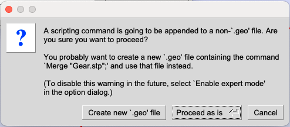
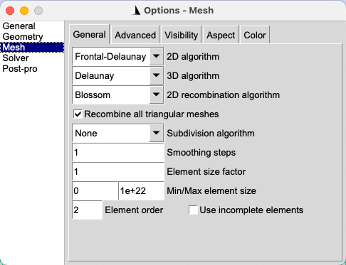
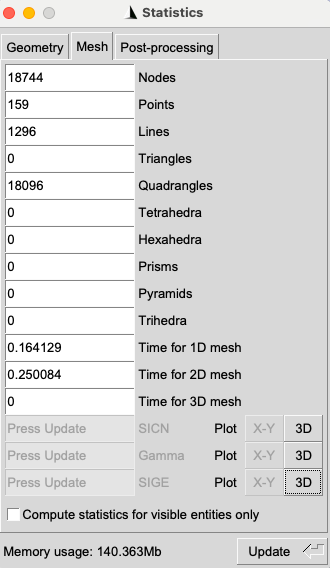
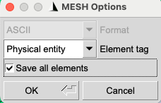
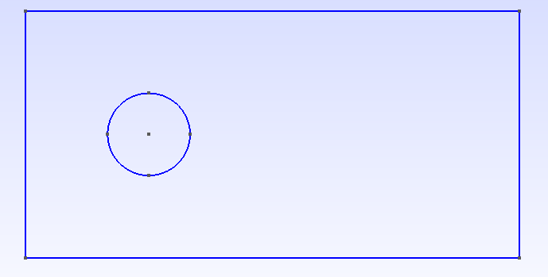
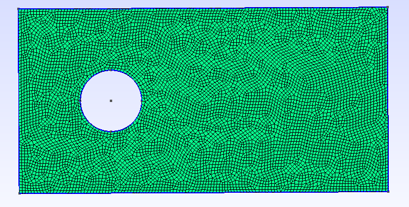

This section covers the mesh generation process for FastVPINNs library using the Gmsh software. The Gmsh software is an open-source mesh generator that can be used to generate 2D and 3D meshes for complex geometries. The Gmsh software can be downloaded from the `Gmsh website <https://gmsh.info/>`_.

**Types of External Mesh Generation**

- `Mesh Generation from External CAD Files <#mesh-generation-from-external-cad-files>`__ : The Gmsh software allows users to import external CAD files in the `.stp` format and generate the mesh. 
- `Mesh generation from GEO files <#mesh-generation-from-geo-files>`__ : Generate the geometry internally within the GEO file, and then generate the mesh.

.. _mesh-generation-from-external-cad-files:

Mesh Generation from External CAD Files
---------------------------------------

In this example, we will create the mesh from externally generated CAD files. The CAD files can be generated using any CAD software, such as `FreeCAD <https://www.freecadweb.org/>`_. For this tutorial, we have exported the CAD file for the gear geometry in the `.stp` format. The sample `.stp` file used for this tutorial can be found :download:`here <../../../downloads/Gear.stp>`.

Loading the CAD File in Gmsh
~~~~~~~~~~~~~~~~~~~~~~~~~~~~

1. Open the Gmsh software and click on the `File` menu.
2. Select the `Open` option and navigate to the location where the CAD file is saved.
3. Select the CAD file and click on the `Open` button.
4. The CAD file will be loaded in the Gmsh software and we should see the geometry in the main window as shown below.

.. image:: ../../../images/gear_geometry.png
   :alt: Gear Geometry
   :align: center

Creating Physical Groups for the Geometry
~~~~~~~~~~~~~~~~~~~~~~~~~~~~~~~~~~~~~~~~~~

1. To create the physical groups for the geometry, click on the `Geometry` menu.
2. Select the `Physical Groups` `->` `Add` `->` `Curve` option.
3. Select the curves that form the outer boundary of the gear geometry, which will form the physical group for the outer boundary.
4. Once all the curves are selected (selected curves will appear in red color), Enter the Name and tag for the physical group. Its advisable to use a numerical value for both name and the tag. Further provide a same value for both the fields for easy identification. In FastVPINNs, we generally start the numbering from 1000 and increment it by 1 for each new physical group. Its important to note that the name and tag should be unique for each physical group and what ever value is provided here should be used in the example file for providing the boundary conditions and boundary values. 

.. image:: ../../../images/physical_group.png
   :alt: Physical Group
   :align: center

5. Once selection is made and the name and tag are filled in the dialog box, press `e` to end the selection. This will add all the selected curves to the physical group.
5. Repeat the above steps to create physical groups for the inner boundary of the gear geometry.
6. Once its done, you can check the `Tools` `->` `Visibility` `->` `Physical Groups` to see the physical groups created for the geometry. Or, you can open the created .GEO file in a text editor to see the physical groups created. Make sure that the physical groups are created correctly and the tags are unique for each physical group.

**Additional:** 
- Refer to the `Gmsh documentation <https://gmsh.info/doc/texinfo/gmsh.html>`_ for more details on creating physical groups in Gmsh. While trying to create physical groups, gmsh will ask if you to save the existing file as a new .GEO file. In this scenario, it is advisable to save the file as a new .GEO file and use the new file for further mesh generation.

General Information on generating quad mesh with Gmsh
~~~~~~~~~~~~~~~~~~~~~~~~~~~~~~~~~~~~~~~~~~~~~~~~~~~~~
1. To generate the quad mesh in gmsh is quite tricky when compared to generating a triangular mesh. The quad mesh generation needs to be done using the `Transfinite` algorithm. It typically involves decomposing your geometry into subregions which is bounded by 4 curves and then specify each curve as a transfinite curve and the region as a transfinite surface. This process is quite complex and requires a carefull decomposition of the geometry into subregions so that it can be bounded by 4 curves. This method is beyond the scope of this tutorial and we recommend the users to refer to the `Gmsh documentation <https://gmsh.info/doc/texinfo/gmsh.html>`_ for more details on generating quad mesh using the transfinite algorithm. The users can also refer to the youtube tutorial on `Youtube: Generating quad mesh on Flow over airfoil <https://www.youtube.com/watch?v=bekRbU7rtZE>`_ for more details on generating quad mesh using the transfinite algorithm.

2. However, we can generate the quad mesh without decomposing the surface by using different Meshing algorithms and recombination algorithms available within the Gmsh software.

3. The below tutorial is based on the gmsh version `4.11.1` on Mac OS. Some of the mesh generation and recombination methods mentioned below might not be available for users with different OS or different versions of Gmsh. However, there are other equivalent meshing and recombination algorithms available in Gmsh which can be used to generate quad meshes. Users are advised to refer to documentation and to try out different meshing and recombination algorithms to generate the necessary quad meshes. 

Generating Quad Mesh in Gmsh
~~~~~~~~~~~~~~~~~~~~~~~~~~~~~

1. Now, lets change the default meshing algorithm to generate `quad` meshes in Gmsh. To change the meshing algorithm, click on the `Tools` `->` `Options` `->` `Mesh` tab. In the `General` section, change the `Meshing algorithm` to `Frontal-Delaunay for Quads (experimental)` and change the 2D recombination algorithm to `Blossom` and also check the checkbox for `Recombine all triangular elements`. Press `OK` to save the changes.

Note: As mentioned earlier, the exact meshing algorithms and recombination algorithms might vary based on the version of Gmsh and the OS. Users are advised to refer to the Gmsh documentation for more details on the meshing and recombination algorithms available in Gmsh.

2. Now, lets generate the mesh by clicking on the `Mesh` `->` `2D` option. This will generate the quad mesh for the gear geometry.

3. The generated mesh can be refined by clicking on the `Mesh` `->` `Refine by splitting` option. This will refine the mesh by splitting the elements.

4. The mesh can be visualized in the main window as shown below. Note: Once the mesh is generated, check the `Tools` `->` `Statistics` to see the number of elements and nodes in the mesh. Ensure that there are no triangular meshes within the domain. **Note: If the mesh elements are not visible, then double click on the empty window and select mesh visibility and turn on 2D mesh elements**

.. image:: ../../../images/quad_mesh_new.png
   :alt: Quad Mesh
   :align: center

Exporting the Mesh
~~~~~~~~~~~~~~~~~~

1. To export the mesh, click on the `File` menu. Then click on the `Export` option. There are multiple formats available to export the mesh. For this tutorial and to use the mesh in FastVPINNs, we will export the mesh in the `.mesh` format. In the save as dropdown, select the `Guess from Extension (*.*)` option and provide the file name with the `.mesh` extension. Click on the `Save` button to save the mesh as shown below.

.. image:: ../../../images/export_mesh.png
   :alt: Export Mesh
   :align: center

2. While exporting the mesh, It will ask for MESH options as shown below. Select the `Physical Entity` on the Element type dropdown and check the `Save all Elements` checkbox. This will save the physical groups created in the .GEO file as physical entities in the .mesh file. Click on the `OK` button to save the mesh as shown below.

Checking the Mesh
~~~~~~~~~~~~~~~~~

1. To check the mesh, open the exported `.mesh` file in a text editor. The mesh file will contain the information about the nodes, elements, and physical entities. Check the physical entities to ensure that the physical groups are saved correctly in the mesh file. Search for `Edges` in the text editor and you should see the physical groups for the boundaries at the last column as shown below. 

.. image:: ../../../images/mesh_file.png
   :alt: Mesh File
   :align: center

2. Ensure that the physical groups you have entered appear in the Edges for mesh file. If the physical groups are not saved correctly, then the boundary conditions and boundary values will not be applied correctly in the FastVPINNs code. Further, Sometimes the values will be exported as `1` and `0`, instead of `1000` and `1001`. In this case, delete the current mesh file and export the mesh file again from Gmsh using the correct configurations. 

3. Search for `Quadrilaterals` and it should show the number of elements within the mesh file. Ensure that the mesh is generated correctly and there are no triangular elements within the mesh file. This can be done by checking for the presence of `Triangles` within the mesh file. If there are triangular elements, then the meshing algorithm needs to be changed to generate quad meshes.

.. _mesh-generation-from-geo-files:

Mesh generation from GEO files
------------------------------

In this example, we will generate the geometry internally within the GEO file and then generate the mesh. The GEO file is a text file that contains the information about the geometry information for the mesh generation within gmsh file. The syntax and available commands for the GEO file are out of the scope of this tutorial. However, we will provide a simple example of generating a geometry within the GEO file and generating the mesh.

Creating the Geometry in GEO file
~~~~~~~~~~~~~~~~~~~~~~~~~~~~~~~~

1. Open a text editor and create a new file with the `.geo` extension. For this tutorial, we will create a simple geometry of a circular hole inside a rectangular domain. The domain starts at (-3,-3) and has length of 12 units in x-direction and 6 units in y-direction. The circular hole is centered at (0,0) and has a radius of 1 unit. The GEO file for this geometry is shown below.

.. code-block:: bash

   // Gmsh .geo file for a rectangular domain with a circular hole

   // Parameters
   x_min = -3;
   y_min = -3;
   x_max = 9;  // -3 + 12 = 9
   y_max = 3;  // -3 + 6 = 3
   radius = 1;
   lc = 0.1;  // Characteristic length for mesh size control

   // Points for the rectangle
   Point(1) = {x_min, y_min, 0, lc};
   Point(2) = {x_max, y_min, 0, lc};
   Point(3) = {x_max, y_max, 0, lc};
   Point(4) = {x_min, y_max, 0, lc};

   // Points for the circle
   Point(5) = {0, 0, 0, lc};  // Center
   Point(6) = {radius, 0, 0, lc};
   Point(7) = {0, radius, 0, lc};
   Point(8) = {-radius, 0, 0, lc};
   Point(9) = {0, -radius, 0, lc};

   // Lines for the rectangle
   Line(1) = {1, 2};
   Line(2) = {2, 3};
   Line(3) = {3, 4};
   Line(4) = {4, 1};

   // Circle arcs
   Circle(5) = {6, 5, 7};
   Circle(6) = {7, 5, 8};
   Circle(7) = {8, 5, 9};
   Circle(8) = {9, 5, 6};

   // Curve loops
   Curve Loop(1) = {1, 2, 3, 4};  // Outer rectangle
   Curve Loop(2) = {5, 6, 7, 8};  // Inner circle

   // Plane surface (with hole)
   Plane Surface(1) = {1, 2};

   // Assign physical groups to bottom wall as 1000
   Physical Line(1000) = {1};

   // Assign physical groups to right wall as 1001
   Physical Line(1001) = {2};

   // Assign physical groups to top wall as 1002
   Physical Line(1002) = {3};

   // Assign physical groups to left wall as 1003
   Physical Line(1003) = {4};

   // Assign physical groups to circle as 1004
   Physical Curve(1004) = {5, 6, 7, 8};

2. Save this file as `rectangular_domain.geo` in a folder and then open the Gmsh software. Click on the `File` menu and select the `Open` option. Navigate to the location where the `rectangular_domain.geo` file is saved and select the file. Click on the `Open` button to load the geometry in Gmsh. The geometry will be displayed in the main window as shown below.

3. The physical groups for the boundaries and the circle are created in the GEO file. The physical groups can be viewed by clicking on the `Tools` `->` `Visibility` `->` `Physical Groups` option. The physical groups will be displayed in the main window as shown below.

4, Follow the same steps as mentioned in the previous section to generate the mesh for the geometry. The mesh can be generated by clicking on the `Mesh` `->` `2D` option. The mesh can be refined by clicking on the `Mesh` `->` `Refine by splitting` option. The mesh can be visualized in the main window as shown below.

