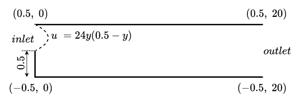
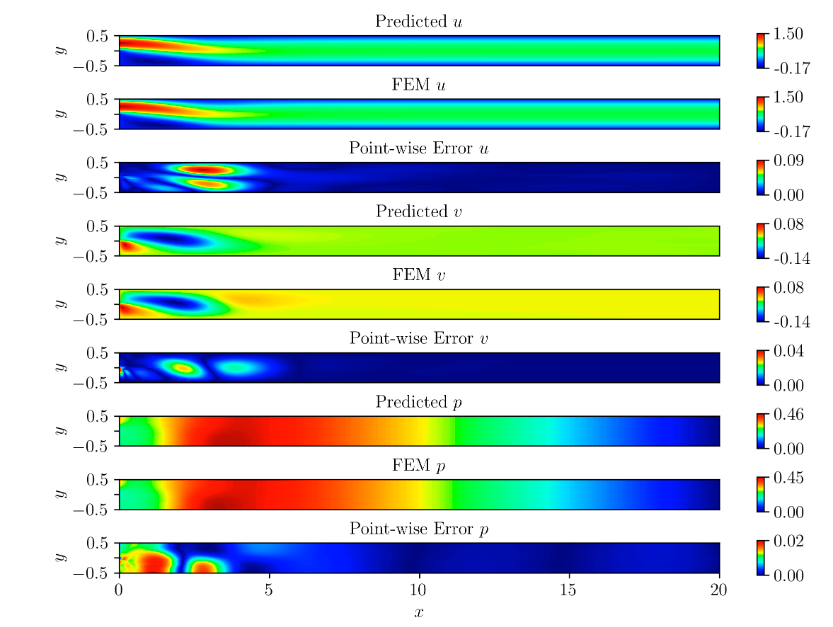

# Solving Navier-Stokes Equations for Flow Past a Backward Facing Step using FastVPINNs

In this example, we will use FastVPINNs to solve the incompressible Navier-Stokes equations for flow past a backward facing step. We'll demonstrate how to set up the problem, define boundary conditions, and use the FastVPINNs framework to obtain the solution.

## Equations

The incompressible Navier-Stokes equations in two dimensions are given by:

$$
\begin{aligned}
u \cdot \nabla u - \frac{1}{Re} \nabla^2 u + \nabla p &= f_x, \\
u \cdot \nabla v - \frac{1}{Re} \nabla^2 v + \nabla p &= f_y, \\
\nabla \cdot u &= 0,
\end{aligned}
$$

where \(u\) and \(v\) are the velocity components in the \(x\) and \(y\) directions, respectively, \(p\) is the pressure, \(\nu\) is the kinematic viscosity, and \(f_x\) and \(f_y\) are the body forces in the \(x\) and \(y\) directions, respectively.


## Problem Description

The geometry of the domain is defined as 


We use an input parabolic velocity as shown in the figure and we have no-slip boundary conditions on the walls. The inflow velocity is given by \(u = 24y(0.5 - y)\) for \(y \geq 0\) and \(u = 0\) for \(y < 0\). The Reynolds number is set to 200.

## Contents
- [Example File - backward_step.py](#example-file): Defines the boundary conditions, forcing function, and parameters.
- [Input File - input_nse2d_backward_step.yaml](#input-file): Specifies the parameters for the experiment.
- [Main File - main_nse2d_backward_step.py](#main-file): The main script that sets up and runs the simulation.

## Example File
The `backward_step.py` file defines the problem-specific functions and parameters.

### Defining Boundary Conditions
```python
def left_boundary(x, y):
    if y >= 0.0:
        u = 24 * y * (0.5 - y)
    else:
        u = 0.0
    v = 0.0
    p = 0.0
    return [np.ones_like(x) * u, np.ones_like(x) * v, np.ones_like(x) * p]

# Similar functions for right, top, and bottom boundaries
``` 

### Defining Forcing Function
```python
def rhs(x, y):
    u = 0
    v = 0
    p = 0
    return [np.ones_like(x) * u, np.ones_like(x) * v, np.ones_like(x) * p]
```

### Defining Bilinear Parameters
```python
def get_bilinear_params_dict():
    re_nr = 200.0
    return {"re_nr": re_nr}
```

### Defining Penalty Coefficients

These are the penalty coefficients used in the loss function for each equation of the Navier-Stokes equations.

```python
def get_penalty_coefficients_dict():
    """
    This function will return a dictionary of penalty coefficients
    """
    return {"residual_u": 1e1, "residual_v": 1e1, "divergence": 1e1}

```

### Input File
The input_nse2d_backward_step.yaml file specifies the parameters for the simulation:

```yaml
geometry:
  mesh_generation_method: "internal"
  internal_mesh_params:
    x_min: 0
    x_max: 20
    y_min: -0.5
    y_max: 0.5
    n_cells_x: 20
    n_cells_y: 5
```

### Finite Element Parameters
```yaml
fe:
  fe_order: 5
  fe_type: "jacobi"
  quad_order: 8
  quad_type: "gauss-jacobi"
```

### Model Architecture
```yaml
model:
  model_architecture: [2,50,50,50,50,50,50,50,50,3]
  activation: "tanh"
  epochs: 250000
```

## Main File 
The `main_nse2d_backward_step.py` file sets up and runs the simulation.

#### Main imports
```python
from fastvpinns.Geometry.geometry_2d import Geometry_2D
from fastvpinns.FE.fespace2d import Fespace2D
from fastvpinns.data.datahandler2d_vector import DataHandler2D_Vector
from fastvpinns.model.model_nse2d_scaling import DenseModel_NSE2D_Scaling
from fastvpinns.physics.nse2d import pde_loss_nse2d
```
#### Setting up the Geometry and Finite Element Space
```python
domain = Geometry_2D(i_mesh_type, i_mesh_generation_method, i_n_test_points_x, i_n_test_points_y, i_output_path)
cells, boundary_points = domain.generate_quad_mesh_internal(...)
fespace_velocity = Fespace2D(...)
fespace_pressure = Fespace2D(...)
```

#### Read the Dirichlet Boundary Conditions
Read all the boundary values from an external file and set the Dirichlet boundary conditions.
```python
# get the dirichlet input data from external file
    dirichlet_dict_input, dirichlet_dict_output, test_points, y_exact, original_shape = (
        get_dirichlet_and_test_data_external("fem_solutions/RE_NR_200.000000_Backward_Step.csv", i_dtype)
    )
```

#### Scaling Parameters

The scaling factors for input (obtained from the geometry) and the output (obtained from the dirichlet boundary values from external file) are calculated.
```python
params_dict = {}
    params_dict['n_cells'] = fespace_velocity.n_cells
    params_dict['output_scaling_max'] = datahandler_vector.get_output_scaling()
    input_scaling_min, input_scaling_max = datahandler_vector.get_input_scaling(domain.cell_points)
    params_dict['input_scaling_min'] = input_scaling_min
    params_dict['input_scaling_max'] = input_scaling_max

    print(f"Output Scaling Max = {params_dict['output_scaling_max']}")
    print(f"Input Scaling Min = {params_dict['input_scaling_min']}")
    print(f"Input Scaling Max = {params_dict['input_scaling_max']}")
```


#### Instantiating the Model

The `DenseModel_NSE2D_Scaling` class is used to define the model architecture, which also incorporates the scaling parameters.

```python
model = DenseModel_NSE2D_Scaling(
    layer_dims=i_model_architecture,
    learning_rate_dict=i_learning_rate_dict,
    params_dict=params_dict,
    loss_function=pde_loss_nse2d,
    ...
)
```

#### Training the Model
```python
for epoch in range(num_epochs):
    loss = model.train_step(
        beta=beta,
        bilinear_params_dict=bilinear_params_dict,
        regularisation=None,
        penalty_coefficients_dict=penalty_coefficients_dict,
    )
    # Update progress and plot results
```

## Running the Simulation
To run the simulation, execute the following command:

```bash
python main_nse2d_backward_step.py input_nse2d_backward_step.yaml
```

## Solution 
