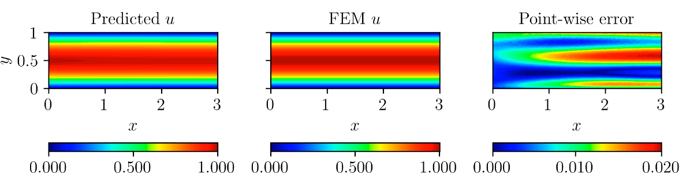

# Solving Navier-Stokes Equations for Flow Through Channel using FastVPINNs

In this example, we will use FastVPINNs to solve the incompressible Navier-Stokes equations for Flow Through Channel Problem. We'll demonstrate how to set up the problem, define boundary conditions, and use the FastVPINNs framework to obtain the solution.


## Equations

The incompressible Navier-Stokes equations in two dimensions are given by:

$$
\begin{aligned}
u \cdot \nabla u - \frac{1}{Re} \nabla^2 u + \nabla p &= f_x, \\
u \cdot \nabla v - \frac{1}{Re} \nabla^2 v + \nabla p &= f_y, \\
\nabla \cdot u &= 0,
\end{aligned}
$$

where \(u\) and \(v\) are the velocity components in the \(x\) and \(y\) directions, respectively, \(p\) is the pressure, \(\nu\) is the kinematic viscosity, and \(f_x\) and \(f_y\) are the body forces in the \(x\) and \(y\) directions, respectively.


## Problem Description
 
 The geometry of the domain is defined as [0,1] in y-direction and [0,3] in x-direction. The boundary condition is Dirichlet boundary condition on the inlet with a parabolic velocity profile and no-slip boundary condition on the walls. At outlet, Zero Neumann Boundary condition is applied. The inflow velocity is given by \(u = 4y(1 - y)\) for \(y \geq 0\) and \(u = 0\) for \(y < 0\). The Reynolds number is set to 1.

## Contents
- [Example File - flow_channel.py](#example-file): Defines the boundary conditions, forcing function, and parameters.
- [Input File - input_nse2d_flow.yaml](#input-file): Specifies the parameters for the experiment.
- [Main File - main_nse2d_flow.py](#main-file): The main script that sets up and runs the simulation.

## Example File
The `flow_channel.py` file defines the problem-specific functions and parameters.

### Defining Boundary Conditions
For this problem, all the boundary conditions and boundary values are defined in the example file.

```python
def get_bound_cond_dict():
    """
    This function will return a dictionary of boundary conditions
    If no boundary condition needs to be specified, provide "none" for the component
    Accepted Values : "dirichlet", "neumann"
    Currently, it works on Homogenous Boundary Conditions only - Either Dirichlet on both components and Neumann on both components
    """
    return {
        1000: ["dirichlet", "dirichlet", "none"],
        1001: ["neumann", "neumann", "none"],
        1002: ["dirichlet", "dirichlet", "none"],
        1003: ["dirichlet", "dirichlet", "none"],
    }

def left_boundary(x, y):
    """
    This function will return the boundary value for given component of a boundary
    """
    u = y * (1 - y) * 4
    v = 0.0
    p = 0.0
    return [np.ones_like(x) * u, np.ones_like(x) * v, np.ones_like(x) * p]
``` 

### Defining Forcing Function
```python
def rhs(x, y):
    u = 0
    v = 0
    p = 0
    return [np.ones_like(x) * u, np.ones_like(x) * v, np.ones_like(x) * p]
```

### Defining Bilinear Parameters
```python
def get_bilinear_params_dict():
    re_nr = 1.0
    return {"re_nr": re_nr}
```

### Defining Penalty Coefficients

These are the penalty coefficients used in the loss function for each equation of the Navier-Stokes equations.

```python
def get_penalty_coefficients_dict():
    """
    This function will return a dictionary of penalty coefficients
    """
    return {"residual_u": 1e-4, "residual_v": 1e-4, "divergence": 1e4}

```


### Input File
The input_nse2d_backward_step.yaml file specifies the parameters for the simulation:

```yaml
geometry:
  mesh_generation_method: "internal"  # Method for generating the mesh. Can be "internal" or "external".
  generate_mesh_plot: True  # Flag indicating whether to generate a plot of the mesh.
  
  # internal mesh generated quadrilateral mesh, depending on the parameters specified below.

  internal_mesh_params:  # Parameters for internal mesh generation method.
    x_min: 0  # Minimum x-coordinate of the domain.
    x_max: 3  # Maximum x-coordinate of the domain.
    y_min: 0  # Minimum y-coordinate of the domain.
    y_max: 1  # Maximum y-coordinate of the domain.
    n_cells_x: 20  # Number of cells in the x-direction.
    n_cells_y: 5  # Number of cells in the y-direction.
    n_boundary_points: 800  # Number of boundary points.
    n_test_points_x: 100  # Number of test points in the x-direction.
    n_test_points_y: 100  # Number of test points in the y-direction.
```

### Finite Element Parameters
```yaml
fe:
  fe_order: 4  # Order of the finite element basis functions.
  fe_type: "jacobi"  # Type of finite element basis functions. Can be "jacobi" or other supported types.
  quad_order: 6  # Order of the quadrature rule.
  quad_type: "gauss-jacobi"  # Type of quadrature rule. Can be "gauss-jacobi" or other supported types.
```

### Model Architecture
```yaml
model:
  model_architecture: [2,20,20,20,20,20, 3]  # Architecture of the neural network model.
  activation: "tanh"  # Activation function used in the neural network.
  use_attention: False  # Flag indicating whether to use attention mechanism in the model.
  epochs: 50000  # Number of training epochs.
  dtype: "float32"  # Data type used for computations.
  set_memory_growth: False  # Flag indicating whether to set memory growth for GPU.
```

## Main File 
The `main_nse2d_flow.py` file sets up and runs the simulation.

#### Main imports
```python
from fastvpinns.Geometry.geometry_2d import Geometry_2D
from fastvpinns.FE.fespace2d import Fespace2D
from fastvpinns.data.datahandler2d_vector import DataHandler2D_Vector
from fastvpinns.model.model_nse2d_scaling import DenseModel_NSE2D_Scaling
from fastvpinns.physics.nse2d import pde_loss_nse2d
```
#### Setting up the Geometry and Finite Element Space
```python
domain = Geometry_2D(i_mesh_type, i_mesh_generation_method, i_n_test_points_x, i_n_test_points_y, i_output_path)
cells, boundary_points = domain.generate_quad_mesh_internal(...)
fespace_velocity = Fespace2D(...)
fespace_pressure = Fespace2D(...)
```


#### Instantiating the Model

The `DenseModel_NSE2D` class is used to define the model architecture,

```python
model = DenseModel_NSE2D(
    layer_dims=i_model_architecture,
    learning_rate_dict=i_learning_rate_dict,
    params_dict=params_dict,
    loss_function=pde_loss_nse2d,
    ...
)
```

#### Training the Model
```python
for epoch in range(num_epochs):
    loss = model.train_step(
        beta=beta,
        bilinear_params_dict=bilinear_params_dict,
        regularisation=None,
        penalty_coefficients_dict=penalty_coefficients_dict,
    )
    # Update progress and plot results
```

## Running the Simulation
To run the simulation, execute the following command:

```bash
python main_nse2d_flow.py input_fs.yaml
```

## Solution 
