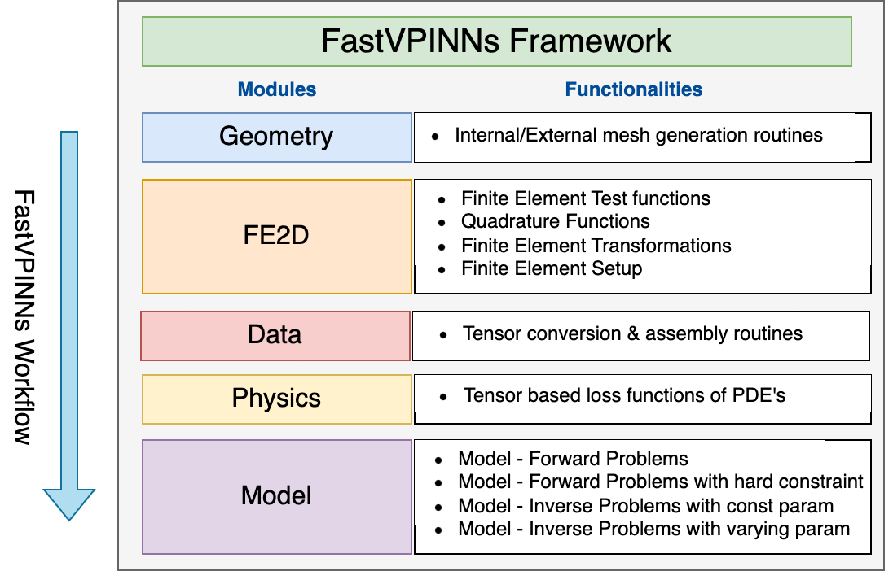

# Introduction

Partial differential equations (PDEs) are essential in modeling physical phenomena such as heat transfer, electromagnetics and fluid dynamics. The current progress in the field of scientific machine learning (SciML) has resulted in incorporating deep learning and data-driven methods to solve PDEs. Let us consider a two-dimensional Poisson equation as an example, defined on the domain $\Omega$, which reads as follows:

\begin{align}
    - \nabla^2 u(x) &= f(x), \quad \Omega \in \mathbb{R}^2,  \\
    u(x) &= g(x), \quad x \in \partial \Omega.
\end{align}

Here, $x \in \Omega$ is the spatial co-ordinate, $u(x)$ is the solution of the PDE, $f(x)$ is a known source term and $g(x)$ is the value of the solution on the domain boundary, $\partial \Omega$. 

A neural network is a parametric function of $x$, denoted as $u_{\text{NN}}(x; W, b)$. In this context, $W$ and $b$ represent the weights and biases of the network. When the neural network consists of $h$ hidden layers, with the $i^{\text{th}}$ layer containing $n_i$ neurons, the mathematical representation of the function takes the following shape:
\begin{equation*}
   u_{\text{NN}}(x; W, b) = l \circ \mathrm{T}^{(h)} \circ \mathrm{T}^{(h-1)} \hdots \circ \mathrm{T}^1(x)
    \label{eq:NN}
\end{equation*}

Here, $l : \mathbb{R}^{n_h} \rightarrow \mathbb{R}$ is a linear mapping in the output layer and $\mathrm{T}^{(i)}(\cdot) = \sigma(W^{(i)} \times \cdot + b^{(i)})$ is a non-linear mapping in the $i^{th}$ layer $( i= 1, 2, \cdots , h)$, with the non-linear activation function $\sigma$ and the weights $W^{(i)}$ and biases $b^{(i)}$ of the respective layers.

Physics-informed neural networks (PINNs), introduced by [@raissi2019physics], work by incorporating the governing equations of the physical systems and the boundary conditions as physics-based constrains to train the neural networks. The core idea of PINNs lies in the ability of obtaining the gradients of the solutions with respect to the input using the automatic differention routines available within deep learning frameworks such as tensorflow [@tensorflow2015-whitepaper]. The loss function for the PINNs can be written as follows:

\begin{align*}
    \begin{split}
        L_p(W,b) &= \frac{1}{N_T}\sum_{t=1}^{N_T}\left|(-\nabla^2 u_{\text{NN}}(x_t;W,b) - f(x_t))\right|^2,\\
        L_b(W,b) &= \frac{1}{N_D}\sum_{d=1}^{N_{D}}\left|u_{\text{NN}}(x_d; W, b) - g(x_d)\right|^2,\\
        L_{\text{PINN}}(W,b) &= L_p + \tau L_b.
    \end{split}
\end{align*}

Here, the output of the neural network, $u_{\text{NN}}(x; W, b)$, is used to approximate the unknown solution. In addition, $N_T$ is the total number of training points in the interior of the domain $\Omega$, $N_D$ is the total number of training points on the boundary $\partial\Omega$, $\tau$ is a scaling factor applied to control the penalty on the boundary term and $L_{\text{PINN}}(W,b)$ is the loss function of the PINNs. 

Variational Physics informed neural networks (VPINNs) [@kharazmi2019variational] are an extension of PINNs, where the weak form of the PDE is used in the loss function of the neural network. The weak form of the PDE is obtained by multiplying the PDE with a test function, integrating over the domain and applying integration by parts to the higher order derivative terms. The method of hp-VPINNs [@kharazmi2021hp] was subsequently developed to increase the accuracy using h-refinement (increasing number of elements) and p-refinement (increasing the number of test functions). The domain $\Omega$ is divided into an array of non-overlapping cells, labeled as $K_k$, where $k=1,2,\ldots,\texttt{N\_{elem}}$, ensuring that the complete union $\bigcup_{k=1}^\texttt{N\_{elem}}K_k = \Omega$ covers the entire domain $\Omega$. The hp-VPINNs framework utilizes specific test functions $v_k$, where $k$ ranges from 1 to N\_elem, that are localized and defined within individual non-overlapping element across the domain.
\begin{equation*}
    v_k= 
    \begin{cases}
      v^p \neq 0, & \text{over $K_k$,} \\
      0, & \text{elsewhere.}
    \end{cases}
    \label{eqn:test_function_summation}
\end{equation*}

The loss function of hp-VPINNs with $\texttt{N\_{elem}}$ elements in the domain can be written as follows.
\begin{align*}
    \begin{split}
        L_v(W,b) &= \frac{1}{\texttt{N\_elem}}\sum_{k=1}^{\texttt{N\_elem}}\left| \int_{K_k} \left( \nabla u_{\text{NN}}(x;W,b) \cdot \nabla v_k dK  ~ - ~ \int_{K_k} f\,v_k\,dK ~\right) ~\right|^2,\\
        L_b(W,b) &= \frac{1}{N_D}\sum_{d=1}^{N_{D}}\left|u_{\text{NN}}(x; W, b) - g(x)\right|^2,\\
        L_{\text{VPINN}}(W,b) &= L_v + \tau L_b.
    \end{split}
\end{align*}

Where $K_k$ is the $k^{th}$ element in the domain, $v_k$ is the test function in the respective element. Further, $L_v(W,b)$ is the weak form PDE residual and $L_{\text{VPINN}}(W,b)$ is the loss function of the hp-VPINNs. For more information on the derivation of the weak form of the PDE and the loss function of hp-VPINNs, refer to [@anandh2024fastvpinns] and [@ganesan2017finite]

# Statement of need

The existing implementation of hp-VPINNs framework [@hp_vpinns_github] suffers from two major challenges. One being the inabilty of the framework to handle complex geometries and the other being the increased training time associated with the increase in number of elements within the domain. In the work [@anandh2024fastvpinns], we presented FastVPINNs, which addresses both of these challenges. FastVPINNs handles complex geometries by using bilinear transformation, and it uses a tensor-based loss computation to reduce the dependency of training time on number of elements. The current implementation of FastVPINNs can acheive an speed-up of upto a 100 times when compared with the existing implementation of hp-VPINNs. We have also shown that with proper hyperparameter selection, FastVPINNs can outperform PINNs both in terms of accuracy and training time, especially for problems with high frequency solutions. 

Our FastVPINNs framework is built using TensorFlow-v2.0 [@tensorflow2015-whitepaper], and provides an elegant API for users to solve both forward and inverse problems for PDEs like the Poisson, Helmholtz and Convection-Diffusion equations. With the current level of API abstraction, users should be able to solve PDEs with less than six API calls as shown in the minimal working example section. The framework is well-documented with examples, which can enable users to get started with the framework with ease.

The ability of the framework to allow users to train a hp-VPINNs to solve a PDE both faster and with minimal code, can result in widespread application of this method on several real-world problems, which often require complex geometries with a large number of elements within the domain.

# Modules

The FastVPINNs framework consists of five core modules, which are Geometry, FE, Data, Physics and Model.

{ height=50% }

## Geometry Module 
This module provides the functionality to define the geometry of the domain. The user can either generate a quadrilateral mesh internally or read an external \verb|.mesh| file. The module also provides the functionality to obtain boundary points for complex geometries. 

## FE Module
The FE module is responsible for handling the finite element test functions and their gradients. The module's functionality can be broadly classified into into four categories:

\begin{itemize}
    \item \textbf{Test functions}: Provides the test function values and its gradients for a given reference element. In our framework, we use Lagrange polynomials as the test functions.
    \item \textbf{Quadrature functions}: Provides the quadrature points and weights for a given element based on the quadrature order and the quadrature method selected by the user. This method will be used for performing the numerical integration of the weak form residual of the PDE.
    \item \textbf{Transformation functions}: Provides the implementation of transformation routines such as affine transformation and bilinear transformation. This can be used to transform the test function values and gradients from the reference element to the actual element.
    \item \textbf{Finite Element Setup}: Provides the functionality to set up the test functions, quadrature rules and the transformation for every element and save them in a common class to access them. Further, it also hosts functions to plot the mesh with quadrature points, assign boundary values based on the boundary points obtained from the geometry module and calculate the forcing term in the residual.
\end{itemize}

*Remark: The module is named FE (Finite Element) Module because of its similarities with classical FEM routines, such as test functions, numerical quadratures and transformations.  However, we would like to state that our framework is not an FEM solver, but an hp-VPINNs solver*

## Data Module:
The Data module collects data from all modules which are required for training and converts them to a tensor data type with the user specified precision (for example, `tf.float32` or `tf.float64`). It also assembles the test function values and gradients to form a three-dimensional tensor, which will be used during the loss computation. 

## Physics Module:
This module contains functions which are used to compute the variational loss function for different PDEs. These functions accept the test function tensors and the predicted gradients from the neural network along with the forcing matrix to compute the PDE residuals using tensor-based operations. 

## Model Module:
This module contains custom subclasses of the `tensorflow.keras.Model` class, which are used to train the neural network. The module provides the functionality to train the neural network using the tensor based loss computation and also provides the functionality to predict the solution of the PDE for a given input.

# Minimal Working Example {#sec:minimal-working-example}

With the higher level of abstraction provided by the FastVPINNs framework, users can solve a PDE with just six API calls. A Minimal working example to solve the Poisson equation using the FastVPINNs framework ca be found [here](https://cmgcds.github.io/fastvpinns/#usage). The example files with detailed documentation can be found in the [Tutorials section](https://cmgcds.github.io/fastvpinns/_rst/_tutorial.html) of the documentation.

# Testing 

The FastVPINNs framework has a strong testing suite, which tests the core functionalities of the framework. The testing suite is built using the `pytest` framework and is integrated with the continuous integration pipeline provided by Github Actions. The testing functionalites can be broadly classified into the three categories:
\begin{itemize}
    \item \textbf{Unit Testing}: Covers the testing of individual modules and their functionalities.
    \item \textbf{Integration Testing}: Covers the overall flow of the framework. Different PDEs are solved with different parameters to check if the accuracy after training is within the acceptable limits. This ensures that the collection of modules work together as expected.
    \item \textbf{Compatibility Testing}: The framework is tested with different versions of Python such as 3.8, 3.9, 3.10, 3.11 and on different versions of OS such as Ubuntu, MacOS and Windows to ensure the compatibility of the framework across different platforms.
\end{itemize}

# Acknowledgements
We thank Shell Research, India, for providing partial funding for this project. We are thankful to the MHRD Grant No.STARS-1/388 (SPADE) for partial support. 

# References
