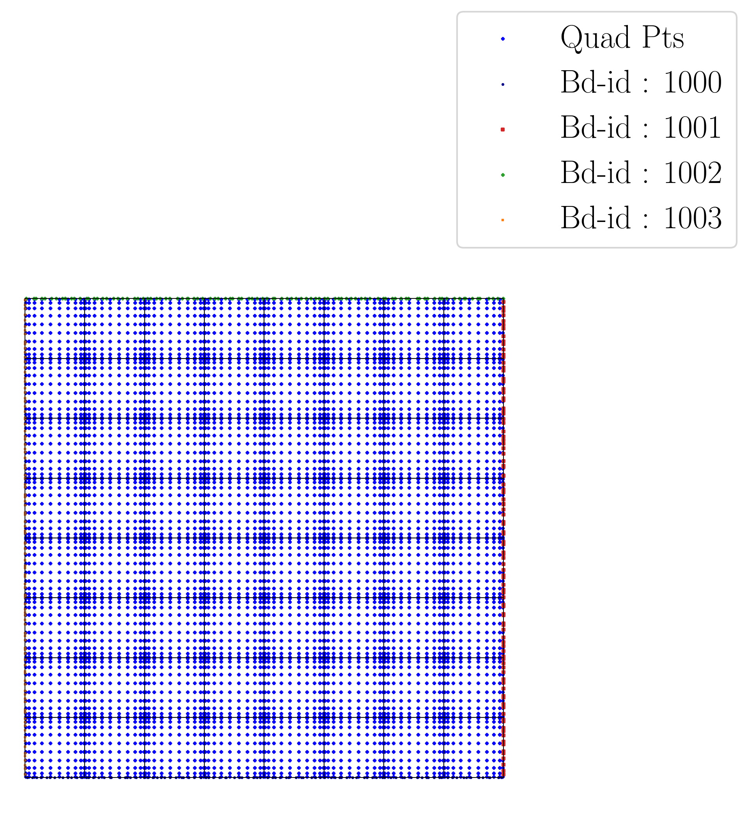
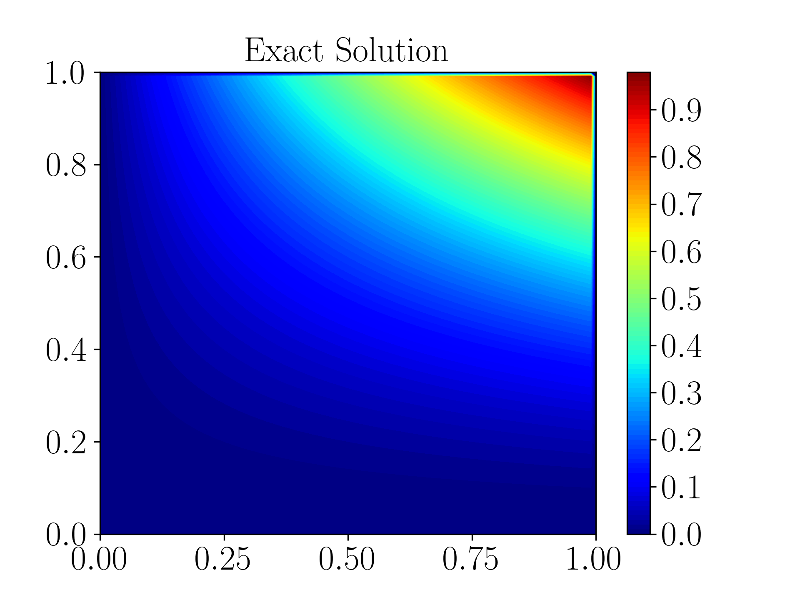
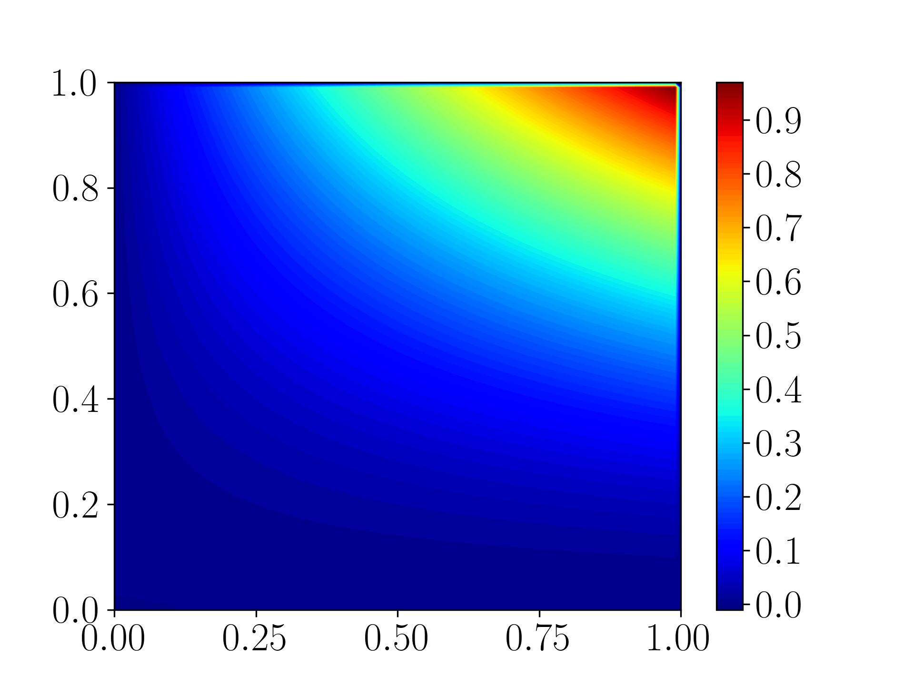
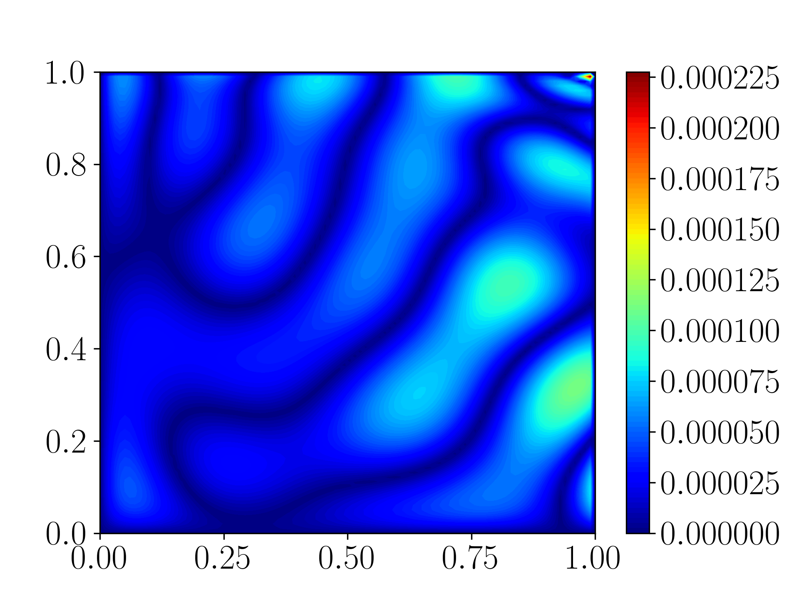

# Outflow Layer Example with Adaptive Indicator Function 

---

This example demonstrates how to solve the outflow layer convection - diffusion equation on a square domain using the `supg_fastvpinns` package. The convection - diffusion equation is given by

$$ -\epsilon \nabla^2 u  + \mathbf{b} \cdot \nabla u + cu = f \quad \text{in} \quad \Omega $$

where $\Omega$ is the square domain and $f$ is the source term. The boundary conditions are given by

$$ u(x,y) := x y^{2} - y^{2}\exp\left(\frac{2(x-1)}{\varepsilon}\right) - x\exp\left(\frac{3(y-1)}{\varepsilon}\right) \\
        + \exp\left(\frac{2(x-1) + 3(y-1)}{\varepsilon}\right)      \text{on} \quad \partial \Omega  $$

For this problem, the parameters are 

$ \epsilon = 1e-8 $ ;  $ \mathbf{b} = [2, 3] $ ; $ c = 1 $

The exact solution is given by

$$ u(x,y) := x y^{2} - y^{2}\exp\left(\frac{2(x-1)}{\varepsilon}\right) - x\exp\left(\frac{3(y-1)}{\varepsilon}\right) \\
        + \exp\left(\frac{2(x-1) + 3(y-1)}{\varepsilon}\right) $$

Note : The forcing formulation for this problem is obtained by substituting the exact solution into the cd2d equation with given pde parameters.

#### Computational Domain
The computational domain is a square with side 1 centered at (0.5, 0.5). 




## Contents
---

- [Outflow Layer Example Adaptive Indicator Function](#outflow-layer-example-with-l2-regularization)
      - [Computational Domain](#computational-domain)
  - [Contents](#contents)
  - [Steps to run the code](#steps-to-run-the-code)
  - [Example File - outflow\_layer\_example.py](#example-file---outflow_layer_examplepy)
    - [Defining the boundary conditions](#defining-the-boundary-conditions)
    - [Defining the source term](#defining-the-source-term)
    - [Defining the exact solution](#defining-the-exact-solution)
    - [Defining the bilinear form](#defining-the-bilinear-form)
  - [Input File](#input-file)
      - [Experimentation](#experimentation)
      - [Geometry](#geometry)
      - [Finite Element Space](#finite-element-space)
      - [pde](#pde)
      - [model](#model)
      - [logging](#logging)
  - [Main File - main\_outflow\_indicator.py](#main-file---main_cd2dpy)
      - [Importing the required libraries](#importing-the-required-libraries)
      - [imports from fastvpinns](#imports-from-fastvpinns)
      - [Reading the input file](#reading-the-input-file)
      - [Reading all input parameters](#reading-all-input-parameters)
      - [Set up the geometry](#set-up-the-geometry)
      - [Setup fespace](#setup-fespace)
      - [Setup datahandler](#setup-datahandler)
      - [Setup model](#setup-model)
      - [Pre-train setup](#pre-train-setup)
      - [Training](#training)
      - [Post Training](#post-training)
  - [save the outputs](#save-the-outputs)
  - [Solution Plots](#solution-plots)
  - [References](#references)


## Steps to run the code
---

To run the code, execute the following command:

```bash
python3 main_outflow_indicator.py input.yaml
```

## Example File - [outflow_layer_example.py](outflow_layer_example.py)
---

This file hosts all the details about the bilinear parameters for the PDE, boundary conditions, source term, and the exact solution. 


### Defining the boundary conditions

Hard constraints are already imposed on the neural network output, thus boundary conditions are already taken care off. The functions `left_boundary`, `right_boundary`, `top_boundary` and `bottom_boundary` would not be used, but they return 0 regardless. 


```python
GLOBAL_EPS_VALUE = 1e-8

def left_boundary(x, y):
    """
    This function will return the boundary value for given component of a boundary
    """

    return np.zeros_like(x)

def right_boundary(x, y):
    """
    This function will return the boundary value for given component of a boundary
    """
    eps = GLOBAL_EPS_VALUE
    
    return np.zeros_like(x)


def top_boundary(x, y):
    """
    This function will return the boundary value for given component of a boundary
    """
    eps = GLOBAL_EPS_VALUE
    
    return np.zeros_like(x)


def bottom_boundary(x, y):
    """
    This function will return the boundary value for given component of a boundary
    """
    eps = GLOBAL_EPS_VALUE
    
    return np.zeros_like(x)
```
Change value of `eps` to solve for different $\varepsilon$ values

Hard Constraint :
$$
u^{\text{hard}}_{\text{NN}}(\mathbf{x}; \theta_W, \theta_b) = h(\mathbf{x}) u_{\text{NN}}(\mathbf{x}; \theta_W, \theta_b)
$$

The ansatz being used for this problem is

$$
h(\mathbf{x}) := \left(1 - e^{-10^\kappa x}\right)\left(1 - e^{-10^\kappa y}\right)\left(1 - e^{-10^{\kappa_1} (1 - x)}\right)\left(1 - e^{-10^{\kappa_1} (1 - y)}\right)
$$
where $\kappa$ and $\kappa_1$ are trainable parameters

This is defined in `DenseModel`
### Defining the source term

The function `rhs` returns the value of the source term at a given point.

```python
def rhs(x, y):
    """
    This function will return the value of the rhs at a given point
    """
    eps = GLOBAL_EPS_VALUE
    return 2*eps*(-x + np.exp(2*(x - 1)/eps)) + x*y**2 + 6*x*y - x*np.exp(3*(y - 1)/eps) - y**2*np.exp(2*(x - 1)/eps) + 2*y**2 - 6*y*np.exp(2*(x - 1)/eps) - 2*np.exp(3*(y - 1)/eps) + np.exp((2*x + 3*y - 5)/eps)

```
[Return to top](#contents)

### Defining the exact solution

The function `exact_solution` returns the value of the exact solution at a given point.

```python
def exact_solution(x, y):
    """
    This function will return the exact solution at a given point
    """
    eps = GLOBAL_EPS_VALUE
   

    return x * ( y**2) - y**2 * np.exp((2*(x-1))/eps) - x * np.exp((3*(y-1))/eps) + np.exp((2*(x-1) + 3*(y-1))/eps)

```
[Return to top](#contents)

### Defining the bilinear form

The function `get_bilinear_params_dict` returns a dictionary of bilinear parameters. The dictionary contains the values of the parameters $\epsilon$ (epsilon), $b_x$ (convection in x-direction), $b_y$ (convection in y-direction), and $c$ (reaction term).

Note : If any of the bilinear parameters are not present in the dictionary (for the cd2d model), then the code will throw an error.

```python
def get_bilinear_params_dict():
    """
    This function will return a dictionary of bilinear parameters
    """
    eps = GLOBAL_EPS_VALUE
    b_x = 2.0
    b_y = 3.0
    c = 1.0
    return {"eps": eps, "b_x": b_x, "b_y": b_y, "c": c}
```
[Return to top](#contents)


## Input File
---

The input file, `input.yaml`, is used to define inputs to your solver. These will usually parameters that will changed often throughout your experimentation, hence it is best practice to pass these parameters externally. 
The input file is divided based on the modules which use the parameter in question, as follows - 

#### Experimentation

This contains `output_path`, a string which specifies which folder will be used to store your outputs.

```yaml
experimentation:
  output_path: "output/outflow_adap_indicator/1"  # Path to the output directory where the results will be saved.
```
[Return to top](#contents)

#### Geometry

This section defines the geometrical parameters for your domain. 
1. In this example, we set the `mesh_generation_method` as `"internal"`. This generates a regular quadrilateral domain with a uniform mesh.
2. The  parameters in `internal_mesh_params` define the x and y limits of the quadrilateral domain(`xmin`, `xmax`, `ymin` and `ymax`), number of cells in the domain in the x and y direction (`n_cells_x` and `n_cells_y`), number of total boundary points (`n_boundary_points`) and number of test points in x and y direction (`n_test_points_x` and `n_test_points_y`).
3. `mesh_type` : FastVPINNs currently provides support for quadrilateral elements only.
4. `external_mesh_params` can be used to specify parameters for the external mesh, and can be ignored for this example

```yaml
geometry:
  mesh_generation_method: "internal"  # Method for generating the mesh. Can be "internal" or "external".
  generate_mesh_plot: True  # Flag indicating whether to generate a plot of the mesh.
  
  # internal mesh generated quadrilateral mesh, depending on the parameters specified below.

  internal_mesh_params:  # Parameters for internal mesh generation method.
    x_min: 0  # Minimum x-coordinate of the domain.
    x_max: 1  # Maximum x-coordinate of the domain.
    y_min: 0  # Minimum y-coordinate of the domain.
    y_max: 1  # Maximum y-coordinate of the domain.
    n_cells_x: 8  # Number of cells in the x-direction.
    n_cells_y: 8  # Number of cells in the y-direction.
    n_boundary_points: 500  # Number of boundary points.
    n_test_points_x: 100  # Number of test points in the x-direction.
    n_test_points_y: 100  # Number of test points in the y-direction.

  mesh_type: "quadrilateral"  # Type of mesh. Can be "quadrilateral" or other supported types.
  
  external_mesh_params:  # Parameters for external mesh generation method.
    mesh_file_name: "meshes/unitsquare_quad.mesh"  # Path to the external mesh file (should be a .mesh file).
    boundary_refinement_level: 4  # Level of refinement for the boundary.
    boundary_sampling_method: "lhs"  # Method for sampling the boundary. Can be "uniform" or "lhs".

```
[Return to top](#contents)

#### Finite Element Space

This section contains the details about the finite element spaces.

```yaml
fe:
  fe_order: 6 # Order of the finite element basis functions.
  fe_type: "jacobi"  # Type of finite element basis functions. Can be "jacobi" or other supported types.
  quad_order: 10  # Order of the quadrature rule.
  quad_type: "gauss-legendre"  # Type of quadrature rule. Can be "gauss-jacobi" or other supported types. 
```

Here the `fe_order` is set to 6 which means it has 6 basis functions in each direction. The `quad_order` is set to 10 which means it uses a 10-points in each direction for the quadrature rule. The supported quadrature rules are "gauss-jacobi" and "gauss-legendre". In this version of code, both "jacobi" and "legendre" refer to the same basis functions (to maintain backward compatibility). The basis functions are special type of Jacobi polynomials defined by $$J_{n} = J_{n-1} - J_{n+1}$$, where $J_{n}$ is the nth Jacobi polynomial.

[Return to top](#contents)

#### pde

This section includes values for `pd_lam` $(\gamma)$ and `lam` $(\lambda)$ which is multiplied to the pde loss, regularization loss

The total loss is given by:

$$
\text{loss}_{\text{total}} = \gamma \cdot \text{loss}_{\text{pde}} + \lambda \cdot \text{loss}_{\text{regularization}} 
$$

here `k` and `k1` are correspond to the initialized value of the trainable parameters $\kappa$ and $\kappa_1$, which are present in the indicator function $h(x)$
```yaml
de:
  beta: 10  # Parameter for the PDE.
  lam : 0
  pd_lam: 1
  k : 1
  k1 : 4
```
[Return to top](#contents)

#### model

The model section contains the details about the dense model to be used. The model architecture is given by the `model_architecture` parameter. The activation function used in the model is given by the `activation` parameter.  The `epochs` parameter is the number of training epochs. The `dtype` parameter is the data type used for computations. The `learning_rate` section contains the parameters for learning rate scheduling. The `initial_learning_rate` parameter is the initial learning rate. The `use_lr_scheduler` parameter is a flag indicating whether to use the learning rate scheduler. The `decay_steps` parameter is the number of steps between each learning rate decay. The `decay_rate` parameter is the decay rate for the learning rate. The `staircase` parameter is a flag indicating whether to use the staircase decay. 

Any parameter which are not mentioned above are archived parameters, which are not used in the current version of the code. (like `use_attention`, `set_memory_growth`)

```yaml
model:
  model_architecture: [2, 30, 30, 30, 30, 30, 30, 30, 1] # Architecture of the neural network model.
  activation: "tanh"  # Activation function used in the neural network.
  use_attention: False  # Flag indicating whether to use attention mechanism in the model.
  epochs: 50000  # Number of training epochs.
  dtype: "float64"  # Data type used for computations.
  set_memory_growth: False  # Flag indicating whether to set memory growth for GPU.
  
  learning_rate:  # Parameters for learning rate scheduling.
    initial_learning_rate: 0.001111111111 # Initial learning rate.
    use_lr_scheduler: False  # Flag indicating whether to use learning rate scheduler.
    decay_steps: 20000  # Number of steps between each learning rate decay.
    decay_rate: 0.95  # Decay rate for the learning rate.
    staircase: False  # Flag indicating whether to use staircase decay.
```
[Return to top](#contents)

#### logging

`update_console_output` defines the epochs at which you need to log parameters like loss, time taken, etc.

```yaml
logging:
  update_progress_bar: 100  # Number of steps between each update of the progress bar.
  update_console_output: 5000  # Number of steps between each update of the console output.
  update_solution_images: 10000  # Number of steps between each update of the intermediate solution images.
  test_error_last_n_epochs: 1000 # Takes least test error of last 'n' epochs
```

The other parameters such as `update_progress_bar`, `update_solution_images` are archived parameters which are not used in the current version of the code.

[Return to top](#contents)

## Main File - [main_outflow_indicator.py](main_outflow_indicator.py)
---

This file contains the main code to solve the outflow layer problem. The code reads the input file, sets up the problem, and solves the outflow layer problem using the `supg_fastvpinns` package.


#### Importing the required libraries

The following libraries are imported in the main file.

```python
import numpy as np
import pandas as pd
import pytest
import tensorflow as tf
import keras
from pathlib import Path
from tqdm import tqdm
from rich.progress import track
from rich.console import Console
from rich.table import Table
from rich.progress import Progress, TextColumn, BarColumn, TimeElapsedColumn
from datetime import datetime
import yaml
import sys
import os
import time
```
[Return to top](#contents)


#### imports from supg_fastvpinns

The following imports are used from the `supg_fastvpinns` package.

- Imports the geometry module from the `supg_fastvpinns` package, which contains the `Geometry_2D` class responsible for setting up the geometry of the domain. 
```python
from Geometry.geometry_2d import Geometry_2D
```
- Imports the fespace module from the `supg_fastvpinns` package, which contains the `FE_2D` class responsible for setting up the finite element spaces.
```python
from FE_2D.basis_function_2d import *
from FE_2D.fespace2d import Fespace2D
```
- Imports the datahandler module from the `supg_fastvpinns` package, which contains the `DataHandler` class responsible for handling and converting the data to necessary shape for training purposes
```python
from data.datahandler2d import DataHandler
```

- Imports the model module from the `supg_fastvpinns` package, which contains the `Model` class responsible for training the neural network model.
```python
from model.model_indicator_outflow import DenseModel
```

- Import the Loss module from the `supg_fastvpinns` package, which contains the loss function of the PDE to be solved in tensor form.
```python
from physics.cd2d import pde_loss_cd2d
```

- Import additional functionalities from the `supg_fastvpinns` package.
```python
from utils.plot_utils import plot_contour, plot_loss_function, plot_test_loss_function
from utils.compute_utils import compute_errors_combined
from utils.print_utils import print_table
```
- Importing the outflow layer example file
```python
from outflow_layer_example import *
```

[Return to top](#contents)


#### Reading the input file

The input file is read using the `yaml` library.

```python
if __name__ == "__main__":
    # check input arguments
    if len(sys.argv) != 2:
        print("Usage: python main.py <config_file>")
        sys.exit(1)

    # Read the YAML file
    with open(sys.argv[1], 'r') as f:
        config = yaml.safe_load(f)
```

#### Reading all input parameters
```python
# Extract the values from the YAML file
    i_output_path = config['experimentation']['output_path']

    i_mesh_generation_method = config['geometry']['mesh_generation_method']
    i_generate_mesh_plot = config['geometry']['generate_mesh_plot']
    i_mesh_type = config['geometry']['mesh_type']
    i_x_min = config['geometry']['internal_mesh_params']['x_min']
    i_x_max = config['geometry']['internal_mesh_params']['x_max']
    i_y_min = config['geometry']['internal_mesh_params']['y_min']
    i_y_max = config['geometry']['internal_mesh_params']['y_max']
    i_n_cells_x = config['geometry']['internal_mesh_params']['n_cells_x']
    i_n_cells_y = config['geometry']['internal_mesh_params']['n_cells_y']
    i_n_boundary_points = config['geometry']['internal_mesh_params']['n_boundary_points']
    i_n_test_points_x = config['geometry']['internal_mesh_params']['n_test_points_x']
    i_n_test_points_y = config['geometry']['internal_mesh_params']['n_test_points_y']

    i_mesh_file_name = config['geometry']['external_mesh_params']['mesh_file_name']
    i_boundary_refinement_level = config['geometry']['external_mesh_params']['boundary_refinement_level']
    i_boundary_sampling_method = config['geometry']['external_mesh_params']['boundary_sampling_method']

    i_fe_order = config['fe']['fe_order']
    i_fe_type = config['fe']['fe_type']
    i_quad_order = config['fe']['quad_order']
    i_quad_type = config['fe']['quad_type']


    i_model_architecture = config['model']['model_architecture']
    i_activation = config['model']['activation']
    i_use_attention = config['model']['use_attention']
    i_epochs = config['model']['epochs']
    i_dtype = config['model']['dtype']
    if i_dtype == "float64":
        i_dtype = tf.float64
    elif i_dtype == "float32":
        i_dtype = tf.float32
    else:
        print("[ERROR] The given dtype is not a valid tensorflow dtype")
        raise ValueError("The given dtype is not a valid tensorflow dtype")
    
    i_set_memory_growth = config['model']['set_memory_growth']
    i_learning_rate_dict = config['model']['learning_rate']

    i_beta = config['pde']['beta']
    i_lam = config['pde']['lam']
    i_pd_lam = config['pde']['pd_lam']
    i_k = config['pde']['k']
    i_k1 = config['pde']['k1']

    i_update_progress_bar = config['logging']['update_progress_bar']
    i_update_console_output = config['logging']['update_console_output']
    i_update_solution_images = config['logging']['update_solution_images']
    i_test_error_last_n_epochs = config['logging']['test_error_last_n_epochs']

```

all the variables which are named with the prefix `i_` are input parameters which are read from the input file.
[Return to top](#contents)


#### Set up the geometry

```python
domain = Geometry_2D(i_mesh_type, i_mesh_generation_method, i_n_test_points_x, i_n_test_points_y, i_output_path)
```
This will instantiate a `Geometry_2D` object, `domain`, with the mesh type, mesh generation method and test points. In our example, the mesh generation method is `internal`, so the cells and boundary points will be obtained using the `generate_quad_mesh_internal` method.


```python
cells, boundary_points = domain.generate_quad_mesh_internal(
            x_limits=[i_x_min, i_x_max],
            y_limits=[i_y_min, i_y_max],
            n_cells_x=i_n_cells_x,
            n_cells_y=i_n_cells_y,
            num_boundary_points=i_n_boundary_points,
        )
```
[Return to top](#contents)


#### Setup fespace 

Initialise the `Fespace2D` class with the required parameters.

```python
fespace = Fespace2D(mesh = domain.mesh, cells=cells, boundary_points=boundary_points, 
                        cell_type=domain.mesh_type, fe_order=i_fe_order, fe_type =i_fe_type ,quad_order=i_quad_order, quad_type = i_quad_type, \
                        fe_transformation_type="bilinear", bound_function_dict = bound_function_dict, \
                        bound_condition_dict = bound_condition_dict, \
                        forcing_function=rhs, output_path=i_output_path, generate_mesh_plot = i_generate_mesh_plot)
```
[Return to top](#contents)


#### Setup datahandler

Initialise the `DataHandler` class with the required parameters.

```python
    datahandler = DataHandler2D(fespace, domain, dtype=i_dtype)
```
[Return to top](#contents)


#### Setup model

Setup the necesary parameters for the model and initialise the `Model` class. Before that fill the `params` dictionary with the required parameters.

```python
    model = DenseModel(layer_dims = i_model_architecture, learning_rate_dict = i_learning_rate_dict, \
                       params_dict = params_dict, \
                       loss_function = pde_loss_cd2d, input_tensors_list = [datahandler.x_pde_list, train_dirichlet_input, train_dirichlet_output], \
                        orig_factor_matrices = [datahandler.shape_val_mat_list , datahandler.grad_x_mat_list, datahandler.grad_y_mat_list], \
                        force_function_list=datahandler.forcing_function_list, \
                        tensor_dtype = i_dtype,  k = float(i_k), k1 = float(i_k1),
                        use_attention=i_use_attention, \
                        activation=i_activation, \
                        hessian=False)
```
[Return to top](#contents)


#### Pre-train setup

```python
test_points = domain.get_test_points()
    console.print(f"[bold]Number of Test Points = [/bold] {test_points.shape[0]}")
    y_exact = exact_solution(test_points[:,0], test_points[:,1])
    

    # save points for plotting
    if i_mesh_generation_method == "internal":
        X = test_points[:,0].reshape(i_n_test_points_x, i_n_test_points_y)
        Y = test_points[:,1].reshape(i_n_test_points_x, i_n_test_points_y)
        Y_Exact_Matrix = y_exact.reshape(i_n_test_points_x, i_n_test_points_y)

        # plot the exact solution
        plot_contour(x = X, y = Y, z = Y_Exact_Matrix, output_path = i_output_path, filename= "exact_solution", title = "Exact Solution")
    
    # ---------------------------------------------------------------#
    # ------------- PRE TRAINING INITIALISATIONS ------------------  #
    # ---------------------------------------------------------------#
    num_epochs = i_epochs  # num_epochs
    progress_bar = tqdm(total=num_epochs, desc='Training', unit='epoch', bar_format="{l_bar}{bar:40}{r_bar}{bar:-10b}", colour="green", ncols=100)
    loss_array = []   # total loss
    pde_loss_array = [] # pde Loss
    regularisation_loss = [] # regularisation Loss
    pde_loss_wtsupg_array = []
    supg_loss_array = []
    tau_array = []
    l2_lamda_array = [] # l2_lambda
    test_l1_loss_array = []
    test_l2_loss_array = []
    test_linf_loss_array = []
    k_list = []
    k1_list = []
    epoch_array = [] # Epoch_array
    time_array = []   # time per epoc  
```
This sets up the test points and the exact solution. The progress bar is initialised and the loss arrays are set up. The beta value is set up as a constant tensor.
[Return to top](#contents)


#### Training

```python
for epoch in range(num_epochs):   
        
        l2_lambda = i_lam
        pd_lambda = i_pd_lam

        # Train the model
        batch_start_time = time.time()
        loss = model.train_step(beta=beta, bilinear_params_dict=bilinear_params_dict, l2_lambda=tf.constant(l2_lambda, dtype = i_dtype), \
                                    pd_lambda =tf.constant(pd_lambda, dtype=i_dtype))
                                    
        
        elapsed = time.time() - batch_start_time
        progress_bar.update(1)
        # print(elapsed)
        time_array.append(elapsed)
        
        
        loss_array.append(loss['loss'])
        regularisation_loss.append(loss['l2_regularisation'])
        pde_loss_array.append(loss['loss_pde'])
        k_list.append(loss['k'])
        k1_list.append(loss['k1'])
```
This `train_step` function trains the model for one epoch and returns the loss. The loss is appended to the loss array. Then for every epoch where 
`(epoch + 1) % i_update_console_output == 0 or epoch == num_epochs - 1:`


```python
             
            # Mean time per epoch
            mean_time = np.mean(time_array[-i_update_console_output:])

            #total time
            total_time_per_intermediate = np.sum(time_array[-i_update_console_output:])

            #epochs per second
            epochs_per_sec = i_update_console_output/np.sum(time_array[-i_update_console_output:])

            y_pred = model(test_points).numpy()
            y_pred = y_pred.reshape(-1,)

            # get errors
            l2_error, linf_error, l2_error_relative, linf_error_relative, \
                l1_error, l1_error_relative = compute_errors_combined(y_exact, y_pred)
            
            loss_pde = float(loss['loss_pde'].numpy())
            loss_dirichlet = float(loss['loss_dirichlet'].numpy())
            total_loss = float(loss['loss'].numpy())
            Reggularisation_loss = float(loss['l2_regularisation'].numpy())
            console.print(f"\nEpoch [bold]{epoch+1}/{num_epochs}[/bold]")
            console.print("[bold]--------------------[/bold]")
            console.print("[bold]Beta : [/bold]" , beta.numpy(), end=" ")
            console.print("[bold]L2_Lambda : [/bold]" , l2_lambda, end=" ")
            console.print("[bold]Pd_Lambda : [/bold]" , pd_lambda, end=" ")
            console.print("[bold]k : [/bold]" , loss['k'], end=" ")
            console.print("[bold]k1 : [/bold]" , loss['k1'], end=" ")
            console.print(f"[bold]Time/epoch : [/bold] {mean_time:.5f} s", end=" ")
            console.print("[bold]Epochs/second : [/bold]" , int(epochs_per_sec), end=" ")
            console.print(f"Learning Rate : {model.optimizer.lr.numpy():.3e}")
            console.print(f"Variational Losses || Pde Loss : [red]{loss_pde:.3e}[/red]  Reg Loss : [red]{Reggularisation_loss:.3e}[/red], \
                                Dirichlet Loss : [red]{loss_dirichlet:.3e}[/red] Total Loss : [red]{total_loss:.3e}[/red]") #Cross wind Loss : [red]{cross_wind_loss:.3e}[/red]
            console.print(f"Test Losses        || L1 Error : {l1_error:.3e}", end=" ")
            console.print(f"L2 Error : {l2_error:.3e}", end=" ")
            console.print(f"Linf Error : {linf_error:.3e}", end="\n")
```

We will compute all the test errors and write the solution to a vtk file for a complex mesh. Further, the console output will be printed with the loss values and the test errors.
[Return to top](#contents)


#### Post Training

```python
# Save the model
    # Save the model
    model.save_weights(str(Path(i_output_path) / "model_weights"))

    
    
    print("[INFO] Model Saved Successfully")

    # predict the values
    y_pred = model(test_points).numpy().reshape(-1,)

    # plot the loss function, prediction, exact solution and error
    plot_loss_function(loss_array, i_output_path)
    
    # get errors
    l2_error, linf_error, l2_error_relative, linf_error_relative, \
                l1_error, l1_error_relative = compute_errors_combined(y_exact, y_pred)
    

    solution_array = np.c_[y_pred, y_exact, np.abs(y_exact - y_pred)]
    
    if i_mesh_generation_method == "internal":
        # reshape y_pred into a 2D array
        y_pred = y_pred.reshape(i_n_test_points_x, i_n_test_points_y)
        
        #Error
        error = np.abs(Y_Exact_Matrix - y_pred)
        
        # plot the prediction
        plot_contour(x = X, y = Y, z = y_pred, output_path = i_output_path, filename= f"final_prediction", title = "Prediction")
        # plot the error
        plot_contour(x = X, y = Y, z = error, output_path = i_output_path, filename= f"final_error", title = "Error")


    elif i_mesh_generation_method == "external":
        solution_array = np.c_[y_pred, y_exact, np.abs(y_exact - y_pred)]
        error = np.abs(y_exact - y_pred)
        domain.write_vtk(solution_array, output_path = i_output_path, filename= f"final_prediction.vtk", data_names = ["Sol","Exact", "Error"] )


    
    # save all the arrays as numpy arrays
    np.savetxt(str(Path(i_output_path) / "loss_function.txt"), np.array(loss_array))
    np.savetxt(str(Path(i_output_path) / "prediction.txt"), y_pred)
    np.savetxt(str(Path(i_output_path) / "exact.txt"), y_exact)
    np.savetxt(str(Path(i_output_path) / "error.txt"), error)
    np.savetxt(str(Path(i_output_path) / "time_per_epoch.txt"), np.array(time_array))

    # copy the input file to the output folder
    os.system(f"cp {sys.argv[1]} {i_output_path}")
```
[Return to top](#contents)


This part of the code saves the model weights, writes the solution to a vtk file, prints the error values in a table, prints the time values in a table, and saves all the arrays as numpy arrays.


## save the outputs
All the outputs will be saved in the output directory specified in the input file. The output directory will contain the following files:

- loss_function.txt : The loss function values for each epoch.
- prediction.txt : The predicted values at last epoch at the test points.
- exact.txt : The exact values at last epoch at the test points.
- error.txt : The error values at last epoch at the test points.
- time_per_epoch.txt : The time taken for each epoch.
[Return to top](#contents)


-- ## Solution Plots
---

<div style="display: flex; justify-content: space-around;">
    <figure>
        
        <figcaption style="text-align: center;">Exact Solution</figcaption>
    </figure>
    <figure>
        
        <figcap<!tion style="text-align: center;">Predicted Solution</figcaption>
    </figure>
    <figure>
        
        <figcaption style="text-align: center;">Error</figcaption>
    </figure>
    

</div> 

## References
---

1. [FastVPINNs: Tensor-Driven Acceleration of VPINNs for Complex Geometries.](https://arxiv.org/abs/2404.12063)

[Return to top](#contents)
